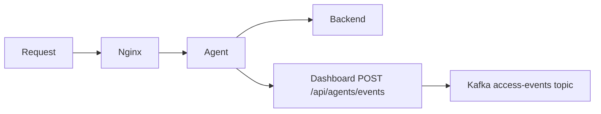

# Agent

The Sentinel Flow Agent is a **Go-based reverse proxy** that sits between your application (e.g., behind Nginx) and your backend. It intercepts requests, extracts metadata, resolves user identity, and **POSTs access events to the Sentinel Flow Dashboard** for ingestion. The agent can fetch latest configuration from the Sentinel Flow API.

## Request Flow



1. Traffic flows through Nginx (or similar) to the agent; the agent forwards the request to your backend.
2. The agent resolves user identity (via headers or `/me` endpoint).
3. The agent sends each access event to the **Dashboard ingestion endpoint** `POST /api/agents/events` with the `Authorization: Bearer <AGENT_TOKEN>` header.
4. The Dashboard validates the token, updates the agent heartbeat, and **produces** the event to Kafka on the configured access-events topic (default **`sf-events-access`**, overridable with `KAFKA_TOPIC_ACCESS_EVENTS` on the Dashboard).

Only requests that carried a **resolved identity** are produced: when `auth_present` is true **and** `user_attr` is present, the Dashboard writes to Kafka. **Unauthenticated** traffic is still acknowledged with success so the agent is never blocked waiting for Kafka; those events are not produced (see `agents.api.events`).

## Capabilities

- **Request interception** — Forwards request metadata without blocking or modifying the original request flow.
- **Role identification** — Extracts `X-User-Id` and fetches role from `/me`, or uses application-provided headers.
- **Role caching** — Local cache for user-to-role mappings (configurable TTL, default 5 minutes).
- **Dashboard ingestion** — Sends structured access events to the Dashboard API; the Dashboard handles Kafka production.

## Event Schema

The JSON body of `POST /api/agents/events` must match **`AccessEventPayload`** (field names and types as implemented in the Dashboard):

| Field           | Type                         | Notes                                      |
| --------------- | ---------------------------- | ------------------------------------------ |
| `trace_id`      | string                       | Correlation id for the request             |
| `method`        | string                       | HTTP method                                |
| `path`          | string                       | Request path                               |
| `query`         | string (optional)            | Query string, if any                       |
| `client_ip`     | string                       | Client IP as seen by the agent             |
| `status`        | number                       | HTTP response status                       |
| `auth_present`  | boolean                      | Whether authentication was present         |
| `user_attr`     | object or `null`             | `{ "user_id": string, "role": string }` or `null` |
| `timestamp`     | string                       | Event timestamp (e.g. ISO-8601)             |

Example:

```json
{
  "trace_id": "abc-123-xyz",
  "method": "GET",
  "path": "/admin/dashboard",
  "query": "tab=settings",
  "client_ip": "192.168.1.100",
  "status": 200,
  "auth_present": true,
  "user_attr": { "user_id": "user_12345", "role": "admin" },
  "timestamp": "2026-02-01T10:30:00Z"
}
```

## Configuration

| Variable             | Example / default in `.env.example` | Description                          |
| -------------------- | ----------------------------------- | ------------------------------------ |
| `AGENT_TOKEN`        | required                            | Bearer token registered with the Dashboard |
| `DASHBOARD_BASE_URL` | `http://localhost:5173`             | Dashboard base URL (events are posted under this origin) |
| `AGENT_LISTEN_ADDR`  | `:9000`                             | Listen address for the proxy         |

## Design Philosophy

Sentinel Flow is **behavior-driven**, not signature-based. The agent focuses on collecting quality telemetry so the detection engine can learn how APIs are actually used and flag deviations.
