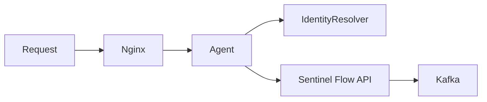

# Agent

The Sentinel Flow Agent is a **Go-based reverse proxy** that sits between your application (e.g., behind Nginx) and your backend. It intercepts requests, extracts metadata, resolves user identity, and forwards access events to Kafka. The agent will fetch latest configuration from the Sentinel Flow API.

## Request Flow



1. Traffic flows through Nginx (or similar) to the agent
2. The agent forwards the request to your backend
3. The agent resolves user identity (via headers or `/me` endpoint)
4. Access events are sent to Backend Sentinel Flow API
5. Backend Service will then Produce event to Kafka

## Capabilities

- **Request Interception** — Receives forwarded request metadata without blocking or modifying the original request flow
- **Role Identification** — Extracts `X-User-Id` and fetches role from `/me` endpoint, or uses application-provided headers
- **Role Caching** — Local cache for user-to-role mappings (configurable TTL, default 5 minutes)
- **Kafka Publishing** — Publishes structured access events for the detection engine

## Event Schema

Events published to Kafka include:

```json
{
  "timestamp": "2026-02-01T10:30:00Z",
  "method": "GET",
  "endpoint": "/admin/dashboard",
  "user_id": "user_12345",
  "role": "admin",
  "source_ip": "192.168.1.100",
  "response_status": 200,
  "trace_id": "abc-123-xyz"
}
```

## Configuration

| Variable             | Default  | Description            |
| -------------------- | -------- | ---------------------- |
| `AGENT_TOKEN`        | required | Agent bearer token     |
| `DASHBOARD_BASE_URL` | required | Dashboard API base URL |
| `AGENT_LISTEN_ADDR`  | `:8080`  | Bind address           |

## Design Philosophy

Sentinel Flow is **behavior-driven**, not signature-based. The agent focuses on collecting quality telemetry so the detection engine can learn how APIs are actually used and flag deviations.
