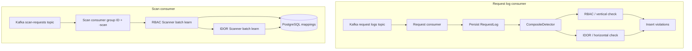

# Detection Engine

The detection engine is the backend service that consumes Kafka messages, persists access events to PostgreSQL, runs **batch learning** scans when asked, and evaluates **real-time violations** using a composite detector.

## Consumers

### 1. Request log consumer

Subscribes to the configured request-log topic (default `sf-events-access`). For each message it:

1. Normalizes the path (including resource ID segments for IDOR-aware paths).
2. Inserts a **RequestLog** row (skipped when both `user_id` and `role` are empty).
3. Runs **`CompositeDetector.DetectAll`** (`internal/detector/composite_detector.go`, wired from `internal/consumer/request_consumer.go`), which evaluates:
   - **RBAC / vertical** — role vs. learned endpoint mappings (`ViolationTypeVerticalIDOR` in storage).
   - **IDOR / horizontal** — requester vs. learned resource ownership (`ViolationTypeHorizontalIDOR`).
4. Persists **zero or more** violations per request (each type is independent).

### 2. Scan consumer

Subscribes to **`KAFKA_TOPIC_SCAN_REQUESTS`** (default `scan-requests`) with consumer group **`KAFKA_GROUP_ID` + `"-scan"`** (see Configuration). It processes messages **one at a time** (single worker): for each message it runs the **RBAC scanner** first, then the **IDOR scanner** sequentially (`internal/consumer/scan_consumer.go`). Both scans refresh their respective in-memory caches used by the live path.

## Processing Flow



## Scan request message (`ScanRequestMessage`)

Optional JSON body on `scan-requests` messages. Unmarshalling errors fall back to environment defaults; empty payload uses defaults.

| Field | Type | Applies to | Description |
|-------|------|------------|-------------|
| `request_id` | string | — | Correlation id (carried in the message for operators/dashboards). |
| `learning_window_days` | int | RBAC + IDOR | Overrides learning window for both scanners when set. |
| `violation_threshold_percent` | float64 | RBAC only | Minimum role traffic share (%) to treat a role as allowed for an endpoint. |
| `minimum_sample_size` | int | RBAC + IDOR | RBAC: minimum total requests per endpoint. IDOR: minimum total accesses per resource before learning. |
| `resource_dominance_percent` | float64 | IDOR only | Minimum share (0–100) of accesses by the top user vs. total for that resource to **create or update** a `user_resource_mapping`. Ignored field: `confirmation_threshold` (deprecated). |

## RBAC learning algorithm (batch scanner)

The RBAC scanner (`internal/scanner/scanner.go`) recomputes **endpoint → allowed roles** from `request_logs` inside the learning window:

```
For each normalized_path:
  Aggregate request counts per role (roles and paths must be non-null).
  If total_requests for that path >= minimum_sample_size:
    For each role on that path:
      If (role_requests / total_requests) * 100 >= violation_threshold_percent:
        Upsert that role as an active allowed mapping for the path
      Else:
        That role is not learned as allowed (no row for it in the active mapping set)
```

Results are written to the endpoint mapping store and the mapping cache is refreshed for real-time RBAC checks.

## IDOR learning (batch scanner)

The IDOR scanner (`internal/scanner/idor_scanner.go`) learns **resource ownership** into **`user_resource_mappings`**: paths whose normalized form contains `:id` or `:uuid`, grouped by `normalized_path`, extracted `resource_id`, and `user_id`. For each resource it picks the **sole** user with the highest access count (ties skip learning), and **only upserts** a row if that user’s share of total accesses is at least **`resource_dominance_percent`** (e.g. 95%). The `confirmed` column is **operator-only** (dashboard): new rows start as `false`, rescans preserve an existing `confirmed` value, and it **does not** affect real-time alerting.

All stored mappings are loaded into the resource cache for horizontal IDOR checks.

**`DefaultIDORScanParams`** (defaults before merging env / message overrides):

| Parameter | Default | Description |
|-----------|---------|-------------|
| `LearningWindowDays` | 90 | Days of `request_logs` considered (also initialized from `LEARNING_WINDOW_DAYS` in `main`). |
| `ResourceDominancePercent` | 95 | Minimum top-user access share (%) vs. total for that resource. |
| `MinimumSampleSize` | 2 | Minimum total accesses per resource before learning. |

## Violation detection (real-time)

After a request is stored, **`CompositeDetector.DetectAll`** may append **both** an RBAC/vertical and an IDOR/horizontal violation **for the same request** if both checks fail. Each violation is inserted independently.

Roughly:

1. **RBAC** — If the endpoint has learned rules and the request’s role is not among allowed roles, emit a vertical-style violation.
2. **IDOR** — If a learned owner exists in `user_resource_mappings` for the path/resource and the requester is not that owner, emit a horizontal-style violation (independent of `confirmed`).

If an endpoint is still below **`minimum_sample_size`** for RBAC learning, no RBAC rules exist yet for that path (learning mode). IDOR behavior depends on existing resource mappings and path shape.

## Configurable parameters (environment)

| Parameter | Default | Description |
|-----------|---------|-------------|
| `learning_window_days` | 90 | Default learning window (RBAC scan, IDOR scan seed from env). |
| `violation_threshold_percent` | 5 | RBAC: minimum percentage for an allowed role. |
| `minimum_sample_size` | 100 | RBAC: minimum requests per endpoint before rules. (IDOR scan defaults use 2 from `DefaultIDORScanParams` unless overridden by a scan message.) |
| `idor_resource_dominance_percent` | 95 | IDOR: minimum top-user share (%) to learn a `user_resource_mapping` (`ResourceDominancePercent`). |

## Configuration

| Variable | Default | Description |
|----------|---------|-------------|
| `DATABASE_URL` | — | PostgreSQL connection string |
| `KAFKA_BROKERS` | `localhost:9092` | Kafka brokers |
| `KAFKA_TOPIC_REQUEST_LOGS` | `sf-events-access` | Topic for access events (request consumer) |
| `KAFKA_TOPIC_SCAN_REQUESTS` | `scan-requests` | Topic for batch scan triggers (scan consumer) |
| `KAFKA_GROUP_ID` | `detection-engine` | Consumer group for the request consumer; scan consumer uses **`{KAFKA_GROUP_ID}-scan`** |
| `LEARNING_WINDOW_DAYS` | 90 | Learning window in days |
| `VIOLATION_THRESHOLD_PERCENT` | 5 | Minimum percentage for allowed role (RBAC scanner) |
| `MINIMUM_SAMPLE_SIZE` | 100 | Minimum requests per endpoint for RBAC learning |
| `IDOR_RESOURCE_DOMINANCE_PERCENT` | 95 | IDOR: minimum dominant user access share (%) per resource |
