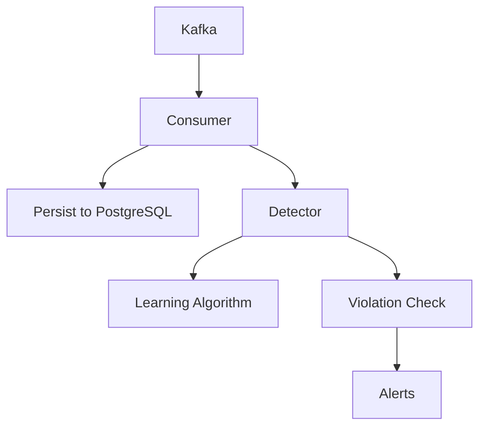

# Detection Engine

The detection engine is the backend service that consumes access events from Kafka, persists them to PostgreSQL, and runs the learning and violation detection logic.

## Processing Flow



## Learning Algorithm

The system generates endpoint-to-role mappings based on traffic patterns:

```
For each endpoint:
  If total_requests >= minimum_sample_size:
    For each role accessing the endpoint:
      If (role_requests / total_requests) >= threshold:
        Mark role as "allowed" for endpoint
      Else:
        Mark role as "violation candidate"
```

## Configurable Parameters

| Parameter | Default | Description |
|-----------|---------|-------------|
| `learning_window_days` | 90 | Days of traffic data used for learning |
| `violation_threshold_percent` | 5 | Minimum percentage for a role to be considered legitimate |
| `minimum_sample_size` | 100 | Minimum requests before generating rules for an endpoint |

## Violation Detection

For each incoming request (after learning data exists):

1. Look up learned mappings for the endpoint
2. Check if requesting role is in the allowed list
3. If not allowed and the endpoint has learned rules, create a violation alert

## Learning Mode

If an endpoint has not yet reached `minimum_sample_size`, no alerts are generated for that endpoint. The system is in "learning mode" until sufficient data is collected.

## Configuration

| Variable | Default | Description |
|----------|---------|-------------|
| `DATABASE_URL` | — | PostgreSQL connection string |
| `KAFKA_BROKERS` | `localhost:9092` | Kafka brokers |
| `KAFKA_TOPIC_REQUEST_LOGS` | `sf-events-access` | Topic for access events |
| `LEARNING_WINDOW_DAYS` | 90 | Learning window in days |
| `VIOLATION_THRESHOLD_PERCENT` | 5 | Minimum percentage for allowed role |
| `MINIMUM_SAMPLE_SIZE` | 100 | Minimum requests per endpoint for learning |
