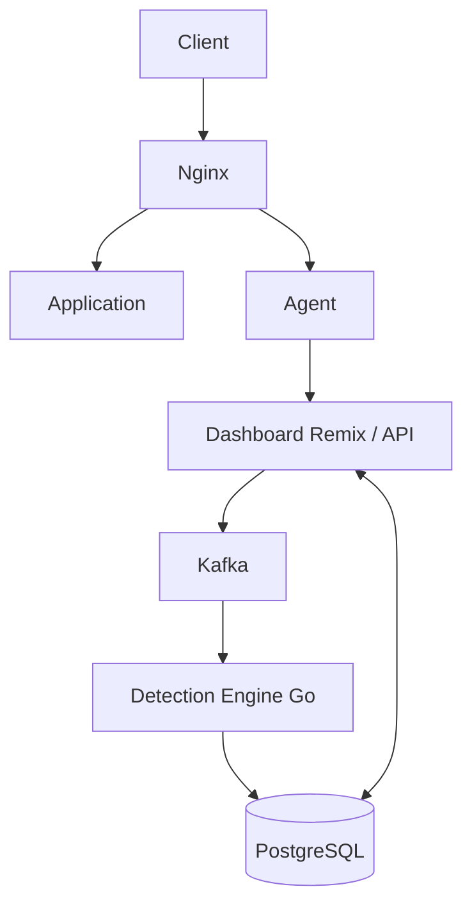

# Overview

Sentinel Flow takes a learning-based approach to access control monitoring. It observes actual traffic patterns and statistically determines which roles legitimately access each endpoint. When a request deviates significantly from learned patterns, it flags the access as a potential violation—including vertical (role vs. route) and horizontal (resource-scoped) IDOR-style cases.

## Core Value Propositions

- **Zero-config rule generation** through traffic-based learning
- **Real-time violation detection** with configurable sensitivity
- **Self-hosted and open-source** with simple Docker deployment
- **Low friction adoption** via lightweight agent architecture

## System Architecture

Traffic flows **Client → Nginx → Application** for the protected app. **Nginx** forwards (or mirrors) through the **Go agent**, which posts telemetry to the **Dashboard API**; the dashboard **produces** to **Kafka**. The **Detection Engine** runs two Kafka consumers by default: **request log** events on `sf-events-access` and **scan requests** on `scan-requests` (configurable via `KAFKA_TOPIC_SCAN_REQUESTS`). It persists learned state, findings, and related data to **PostgreSQL**. The **Dashboard** (UI and API) reads and writes the database for agent registration, findings, **learn-mapping**, and operations.

## Component Overview

| Component | Technology | Responsibility |
|-----------|------------|-----------------|
| Agent | Custom Go | Sits in front of traffic (e.g. via Nginx); extracts metadata; sends events to the Dashboard API; pulls config from the dashboard |
| Dashboard | Remix (Node.js) | Agent registration; ingests agent events and forwards to Kafka; findings and **learn-mapping** UI; APIs backing the UI |
| Message Queue | Kafka | Decouples ingestion from analysis; carries access telemetry and scan work |
| Detection Engine | Go | Consumes **`sf-events-access`** (request logs) and **`scan-requests`** (scan jobs); learns patterns, detects violations, writes to PostgreSQL |
| Database | PostgreSQL | Stores request logs, learned mappings, violations, and configuration |
