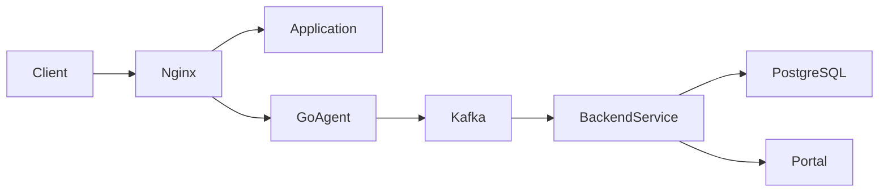

# Overview

Sentinel Flow takes a learning-based approach to access control monitoring. It observes actual traffic patterns and statistically determines which roles legitimately access each endpoint. When a request deviates significantly from learned patterns, it flags the access as a potential violation.

## Core Value Propositions

- **Zero-config rule generation** through traffic-based learning
- **Real-time violation detection** with configurable sensitivity
- **Self-hosted and open-source** with simple Docker deployment
- **Low friction adoption** via lightweight agent architecture

## System Architecture

## Component Overview

| Component | Technology | Responsibility |
|-----------|------------|-----------------|
| Agent | Custom Go | Intercepts requests from Nginx, extracts metadata, forwards to Kafka |
| Message Queue | Kafka | Decouples agent from backend, handles burst traffic |
| Backend Service | Go | Consumes Kafka, stores data, runs detection logic, serves API |
| Database | PostgreSQL | Stores request logs, learned mappings, alerts, configuration |
| Portal | TBD | Displays violations, manages configuration, handles false positives |
