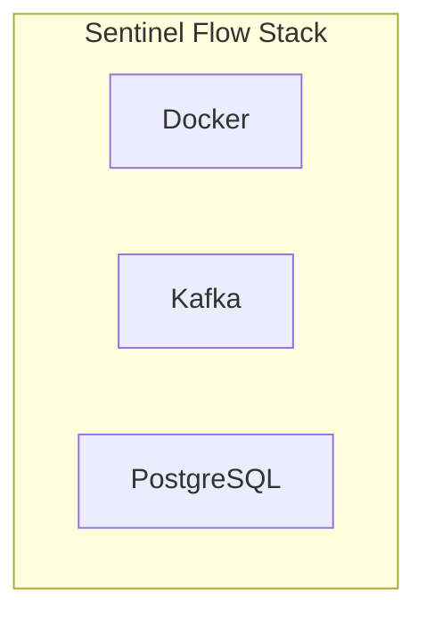

# Tools

Sentinel Flow is built on a minimal set of dependencies, all containerized and deployable via Docker Compose.

## Component Stack



## Docker

Compose brings up, at a high level:

- **agent** — Go reverse proxy; POSTs access events to the Dashboard API; host port **9000** in the bundled Compose file (`9000:9000`).
- **dashboard** — Web app backed by PostgreSQL; can publish batch scan and checker requests to Kafka.
- **detection-engine** — Consumes request logs and scan requests; writes PostgreSQL; runs learning scans and live detection.
- **postgres** — Application database (port 5432).
- **kafka** — Broker (port 9092).
- **zookeeper** — Kafka coordination.
- **ai-agent-checker** — Optional service that consumes check requests from Kafka and runs automated checks against mounted project configs.

Run everything with:

```bash
docker compose up -d
```

## Kafka

Kafka is the **durable event log** between producers and consumers:

- **Decouples** data collection from analysis
- **Handles burst traffic** and backpressure
- **Enables replay** of historical traffic for analysis

| Topic | Producer → Consumer (one line) |
|-------|----------------------------------|
| `sf-events-access` | **Dashboard** (ingests from agent, then produces) → **detection-engine** (request log consumer / live telemetry). |
| `scan-requests` | **Dashboard** → **detection-engine** (batch RBAC then IDOR learning run per message). |
| `sf-check-requests` | **Dashboard** → **ai-agent-checker** (optional; wired in Compose for automated checker jobs). |

## PostgreSQL

PostgreSQL stores:

- **Request logs** — Raw access events (configurable retention)
- **Endpoint mappings** — Learned and manual role-to-endpoint rules (RBAC)
- **`user_resource_mappings`** — Learned resource ownership per normalized path and resource id (horizontal IDOR); includes `confirmed` and access metadata
- **Violations** — Detected access control anomalies, including `violation_type` (`vertical_idor` / `horizontal_idor`), `resource_id`, and `expected_users` where applicable
- **Audit logs** — Configuration changes and false positive handling

Database: `sentinel_flow` (default with docker-compose)

## Minimal Dependencies

Sentinel Flow requires only:

- **PostgreSQL** — For durable storage
- **Kafka** — With Zookeeper or KRaft for event streaming

No additional external services are needed for core functionality; **ai-agent-checker** is optional for AI-assisted checking workflows.
