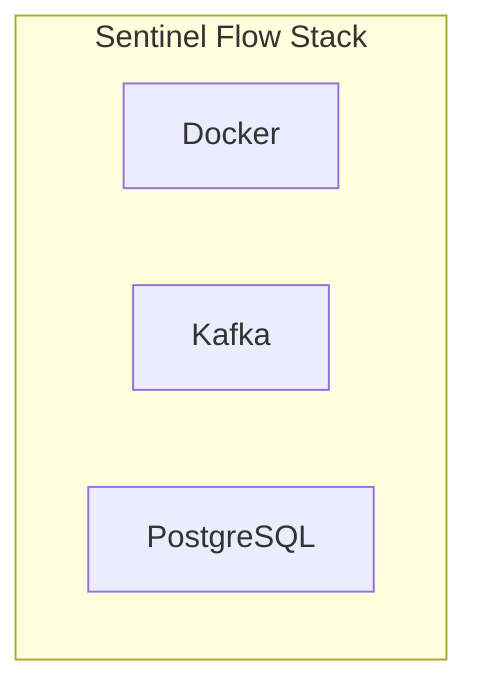

# Tools

Sentinel Flow is built on a minimal set of dependencies, all containerized and deployable via Docker Compose.

## Component Stack



## Docker

All components are containerized for simple setup:

- **Agent** — Go-based reverse proxy, listens on port 9000
- **Detection Engine** — Consumes Kafka, writes to PostgreSQL
- **Zookeeper** — Required for Kafka (or KRaft in future)
- **Kafka** — Message broker on port 9092
- **PostgreSQL** — Database on port 5432

Run everything with:

```bash
docker compose up -d
```

## Kafka

Kafka serves as the **durable event log** between the agent and detection engine:

- **Decouples** data collection from analysis
- **Handles burst traffic** and backpressure
- **Enables replay** of historical traffic for analysis

Key topics:

- `sf-events-access` — Raw access telemetry from the agent
- `scan-requests` — Scan requests for the detection engine

## PostgreSQL

PostgreSQL stores:

- **Request logs** — Raw access events (configurable retention)
- **Endpoint mappings** — Learned and manual role-to-endpoint rules
- **Violations** — Detected access control anomalies
- **Audit logs** — Configuration changes and false positive handling

Database: `sentinel_flow` (default with docker-compose)

## Minimal Dependencies

Sentinel Flow requires only:

- **PostgreSQL** — For durable storage
- **Kafka** — With Zookeeper or KRaft for event streaming

No additional external services are needed for core functionality.
